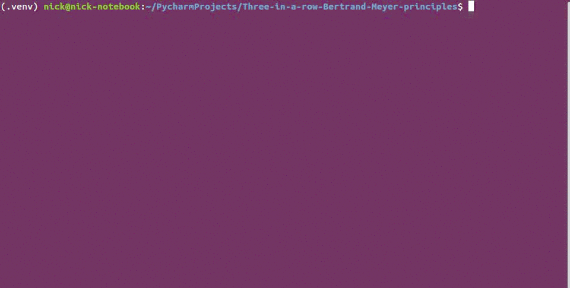
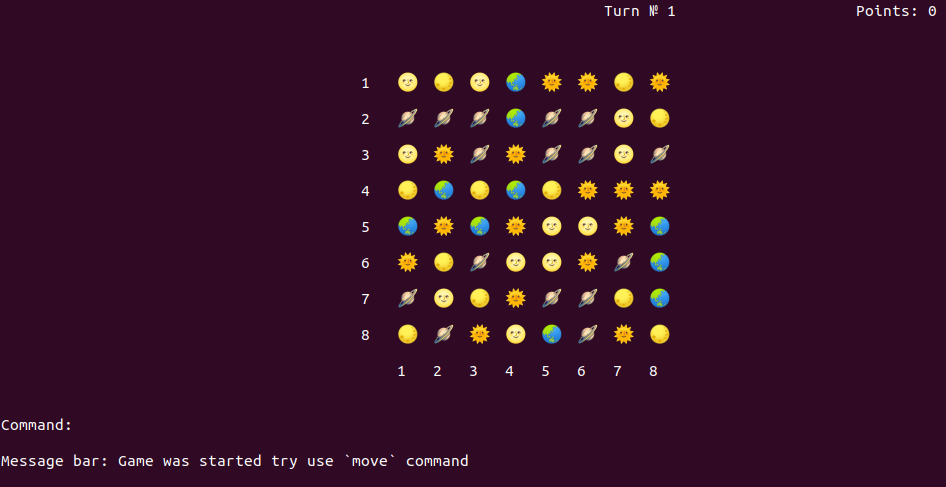
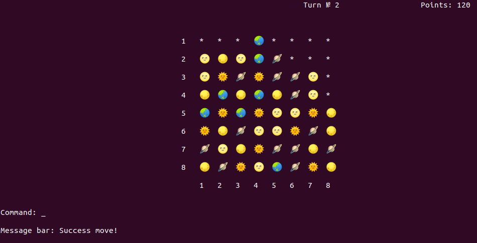
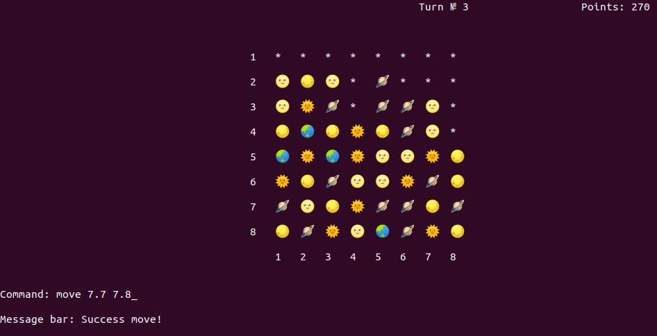
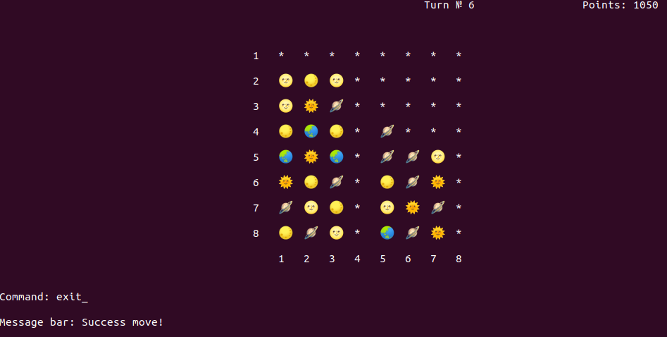

# Three-in-a-row-Bertrand-Meyer-principles

A Three-in-a-row console game

## Getting started

1. Clone this repository:
    ```bash
    git clone git@github.com:MaxFallishe/Three-in-a-row-Bertrand-Meyer-principles.git
    ```

2. Build Docker image:
    ```bash
    docker build -t three-in-a-row-app .
    ```

3. Run Docker image:
    ```bash
    docker run --rm -it three-in-a-row-app
    ```

## GamePlay

* `move` - You can use pattern `move {height.width} {height.width}` for exchanging position for two shards.
For example, command `move 4.3 3.4` will exahnge position of shards that at height=4 width=3 and that at height=3
width=4
* `help` - Used to show information about the game process
* `exit` - Used to exit from game

## Game Screencast



## Game Screenshots









